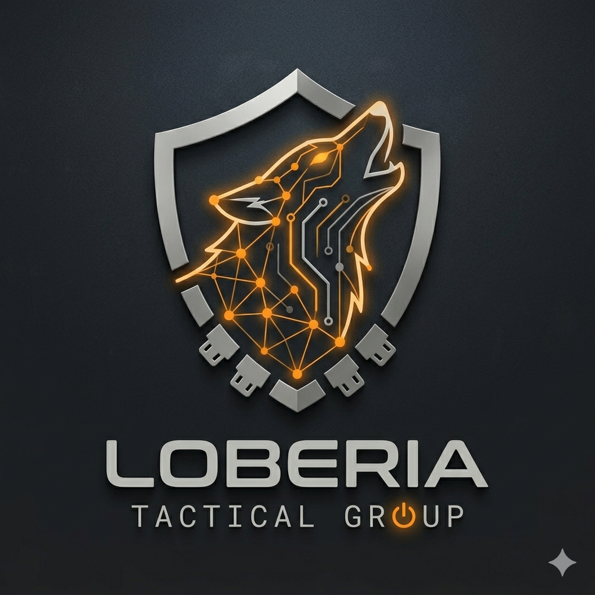

  

# 🛡️ Loberia Hardening-as-Code (HAC)

> **"Secure by design, tactical by execution."**

This repository contains automated scripts designed by **Loberia Tactical Group** to establish high-security baselines on production servers. Our goal is to reduce the attack surface by automating the implementation of **CIS Benchmarks** and industry best practices.

### 🚀 Key Features
* **Automated Firewalling:** Strict inbound/outbound rules.
* **SSH Lockdown:** Disabling root access and enforcing key-based auth.
* **Network Hardening:** Protection against IP spoofing and man-in-the-middle attacks.
* **Intrusion Prevention:** Built-in integration with Fail2Ban.

### ⚠️ Disclaimer
These scripts are intended for **Ethical Hacking** and professional security environments. Always test in a staging environment before applying to production.

---
*Developed by Loberia Tactical Group | 2026*
